<div align="center">

# AgentCraft

**A team of Claude agents doing real work on your code, inside a Minecraft studio you can walk around in.**

*Powered by Claude*

[](LICENSE)
[](https://www.minecraft.net)
[](https://fabricmc.net)
[](https://code.claude.com/docs/en/agent-sdk/overview)
[](foreman/test)

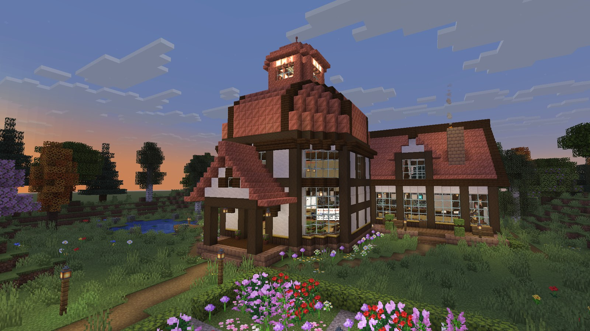

</div>

<br>

Multi-agent coding usually means a wall of terminal text. AgentCraft turns it into a place.

You type a goal. A lead agent reads your repo, writes a plan and pins tasks to a wall. Workers walk to
their desks, sit down and start coding in their own git worktrees while their monitors stream every
file they read and every line they change. When a call is genuinely yours, an agent walks over to
you with a question. When work is ready, you review the real diff and press **Merge**. Nothing
touches your branch without that click, and nothing is ever pushed.

Close the game and the agents keep working. Open it again and the studio catches up.

<br>

## How a goal plays out

<table>
<tr>
<td width="50%" valign="top">

**1. You give a goal.** Press <kbd>`</kbd> and type it. `@juniper` messages a specific agent, with
Tab completion.

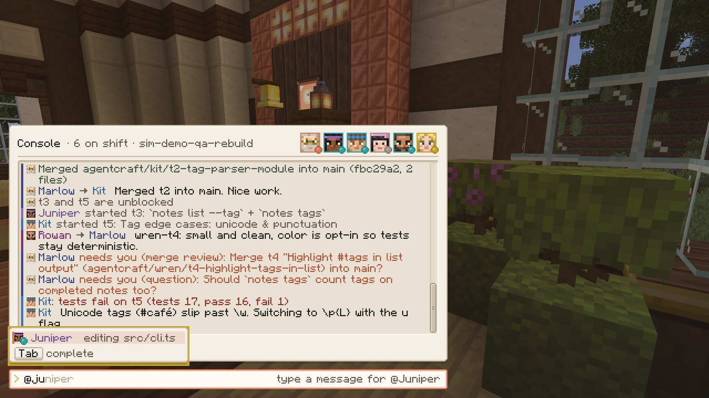

</td>
<td width="50%" valign="top">

**2. The lead plans.** Marlow splits the goal into tasks with dependencies. They land on the Task
Wall, and the plan goes into the shared library.

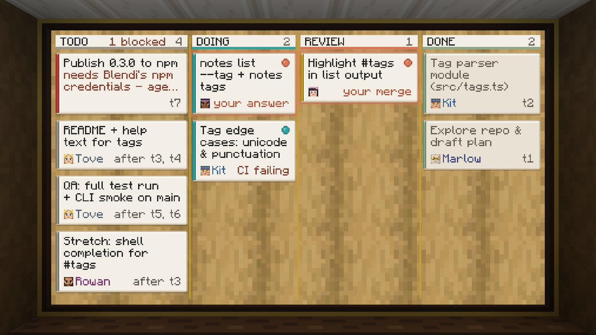

</td>
</tr>
<tr>
<td width="50%" valign="top">

**3. The team builds.** Each worker codes in its own worktree. Monitors stream the live log: tool
calls, test runs, red and green diffs.

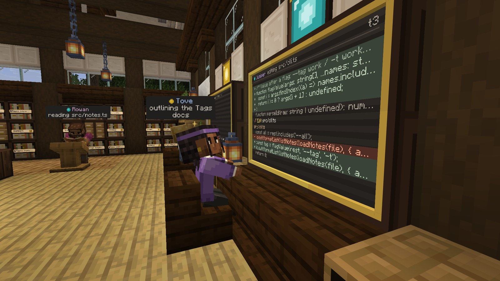

</td>
<td width="50%" valign="top">

**4. They come to you.** A clay <kbd>!</kbd> appears, the bell rings, the agent walks to the
podium. Press <kbd>J</kbd> to answer.

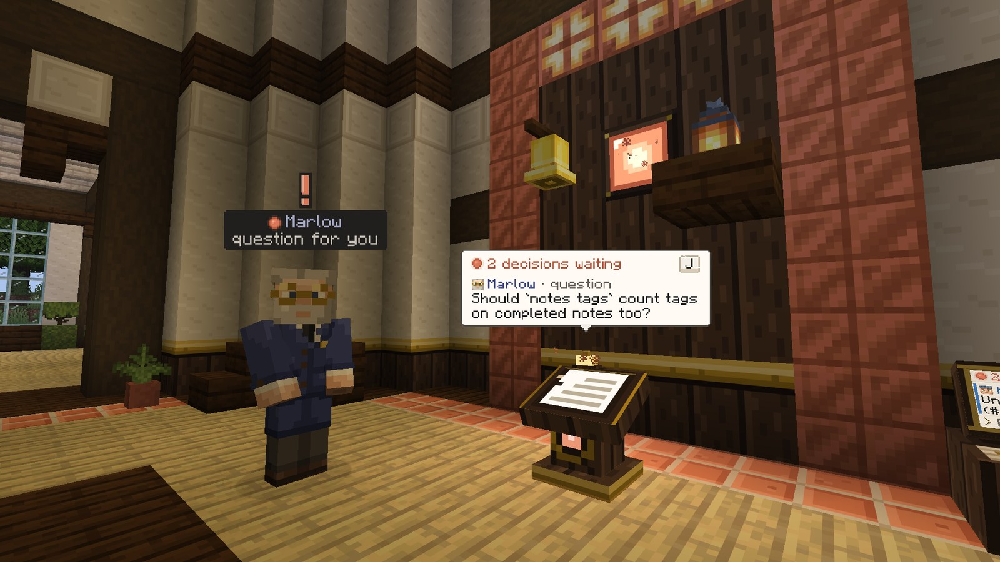

</td>
</tr>
<tr>
<td width="50%" valign="top">

**5. You review and merge.** A real code review screen: file list, line numbers, collapsed context,
the worker's summary and the reviewer's notes.

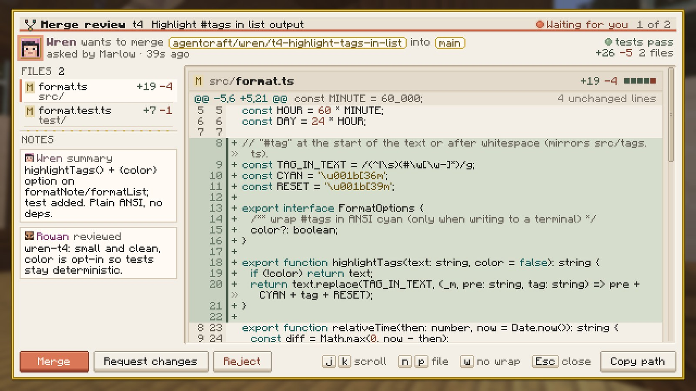

</td>
<td width="50%" valign="top">

**6. Memory stays shared.** The lead's plan, decisions and repo conventions live in a library every
agent reads, and you can too.

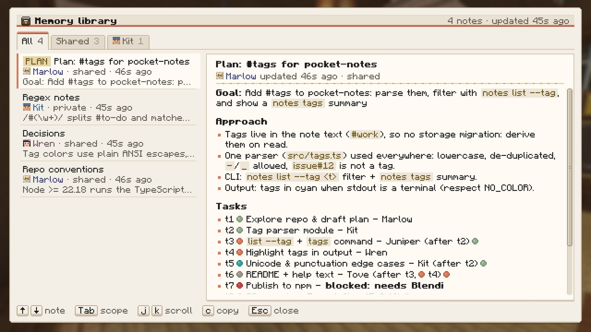

</td>
</tr>
</table>

<br>

## Meet the team

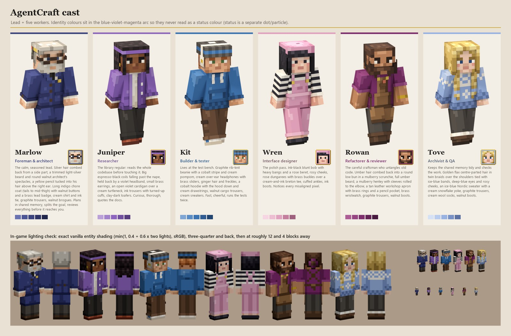

Six hand-pixelled characters, each with their own silhouette and colour. **Marlow** leads: he plans,
splits work and reviews. **Juniper, Kit, Wren, Rowan and Tove** build. They walk the studio with
real pathfinding, sit at their desks while they type, show what they are doing with small particles
and nameplates, talk in speech bubbles, and come find you when they need a decision.

<br>

## The studio

<table>
<tr>
<td width="50%">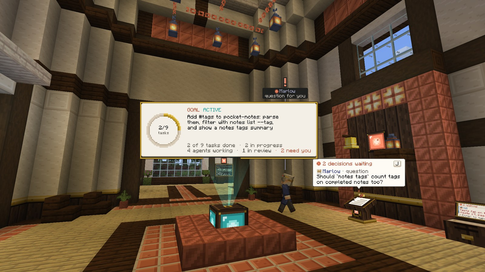</td>
<td width="50%">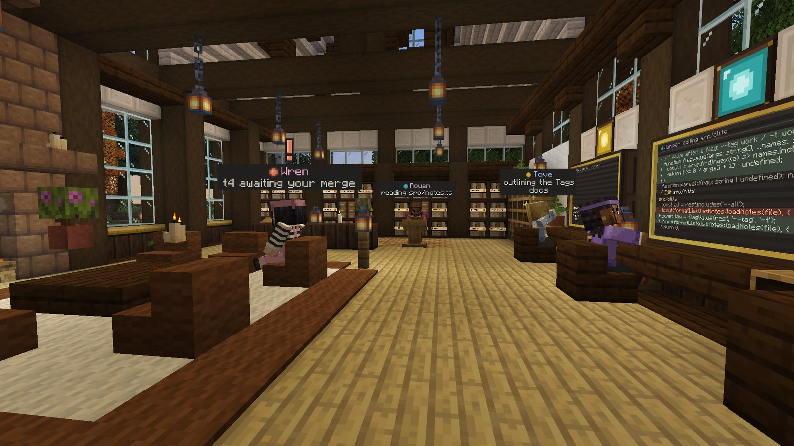</td>
</tr>
<tr>
<td><b>The Goal Atrium.</b> Progress ring, task counts, and how many decisions need you.</td>
<td><b>The studio floor.</b> Desks, status lamps, the library and the lounge.</td>
</tr>
</table>

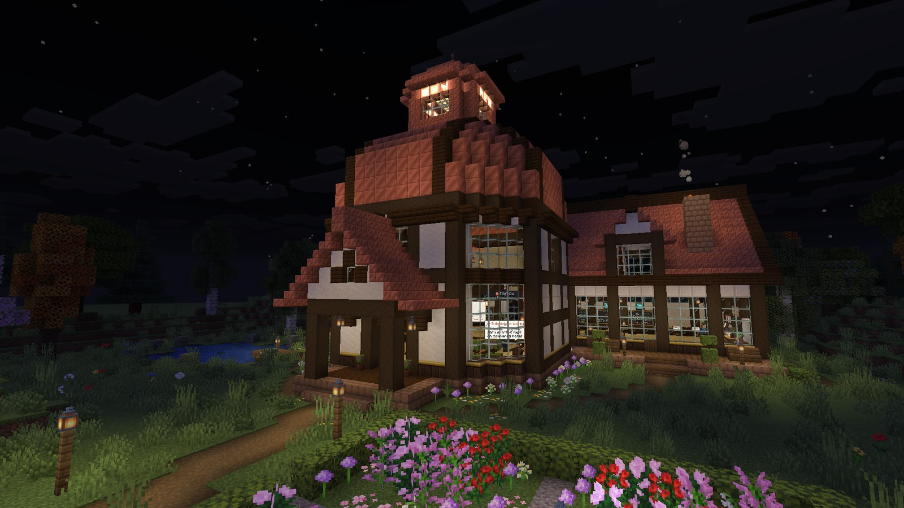

Everything is information you can read at a glance. Far away, the lamps and the cupola beacon tell
you who is working, who is stuck and who is waiting on you. Closer, nameplates and cards tell you
what. Up close, monitors and screens tell you exactly how.

<br>

## Proven with real agents

This is not a mockup. These screenshots come from a real run with Claude agents on a sample repo,
driven entirely through the game: a goal typed into the console, questions and permission prompts
answered in game, merges reviewed in the diff screen, including a merge conflict sent back to the
worker and resolved. The game was restarted mid run and the Foreman was taken offline and brought
back. Six features landed in the repo with its tests passing.

<table>
<tr>
<td width="33%">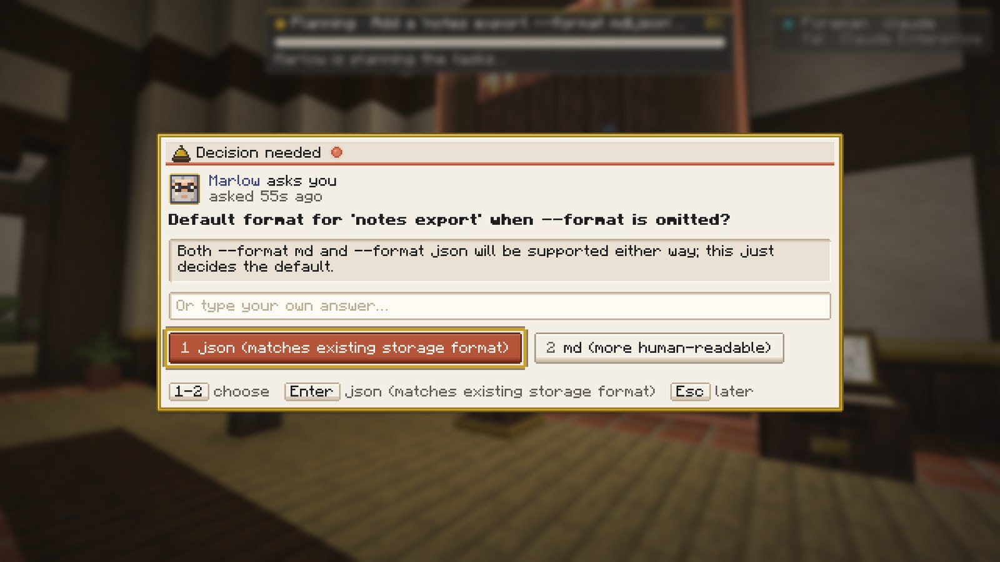</td>
<td width="33%">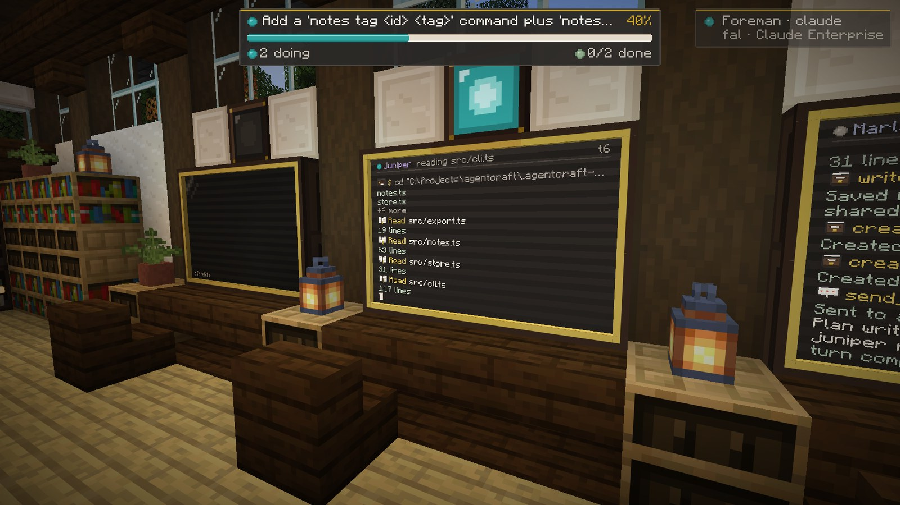</td>
<td width="33%">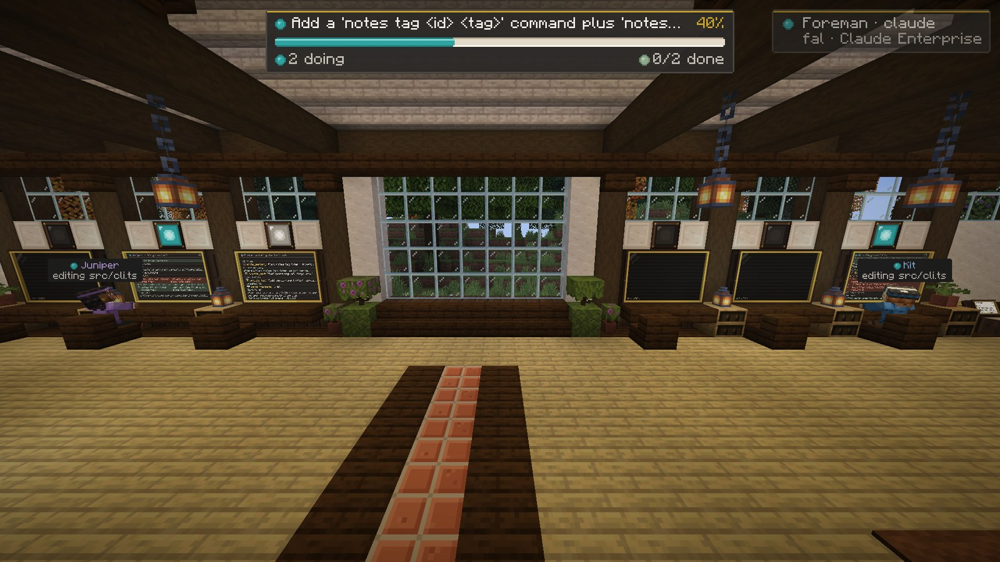</td>
</tr>
<tr>
<td>Marlow asks which default export format to use.</td>
<td>A worker's monitor streaming its live log.</td>
<td>Back online after a Foreman restart, the team resumes.</td>
</tr>
</table>

<br>

## Safe on real repos

AgentCraft is built to point at code you care about.

- **Worktrees, always.** Every task runs in its own git worktree on `agentcraft/<agent>/<task>`. Your
  checkout is never touched by an agent.
- **You merge, nobody else.** A merge happens only when you approve it. It is refused if your
  checkout has uncommitted changes. Conflicts go back to the worker, who resolves them and asks again.
- **Nothing is ever pushed.** Agents get no git network access at all. This is enforced inside git
  itself, not just by a command filter, so even a push hidden in a test script or a hook fails.
- **Risky commands ask first.** Reads and edits inside the worktree are allowed. Anything else
  (writing outside it, network access, destructive commands) becomes an in game permission prompt
  that shows exactly what "Always allow" would cover.
- **Clear authorship.** Agents commit as `AgentCraft <Name>`. Only the merge you approve is made as you.
- **On a shared server, only trusted players drive.** Everyone can watch, but goals, messages,
  answers and merges need op or an entry in `config/agentcraft-allowlist.json`, and each one is
  logged with the player's name.

<br>

## Quick start

**You need:** Windows 10 or 11, macOS, or Linux (X11 or Wayland desktop), Java 25, Node 22+, git, and a copy of
Minecraft: Java Edition.

**For the real agents** you need Claude API access, either of these:

- `ANTHROPIC_API_KEY`: create a key at [console.anthropic.com](https://console.anthropic.com), then
  `setx ANTHROPIC_API_KEY sk-ant-...` (Windows) or `export ANTHROPIC_API_KEY=sk-ant-...` in your
  shell profile (macOS/Linux) and open a new terminal.
- A cloud provider supported by the Agent SDK: Amazon Bedrock (`CLAUDE_CODE_USE_BEDROCK=1`), Google
  Vertex AI (`CLAUDE_CODE_USE_VERTEX=1`) or Microsoft Foundry (`CLAUDE_CODE_USE_FOUNDRY=1`), with that
  provider's usual credentials.

Then:

```powershell
git clone https://github.com/blendi-remade/agentcraft
cd agentcraft

tools\launch.ps1 -Backend sim                    # try it first: a simulated team, no API usage
tools\launch.ps1 -Repo C:\path\to\your\repo      # real agents on your repo
tools\stop.ps1                                   # stop everything launch.ps1 started
```

On macOS, install Java 25 with `brew install openjdk@25`; on Linux, install any JDK 25 (for
example Temurin 25 from [adoptium.net](https://adoptium.net) or your distro's `openjdk-25`).
Then run from the checkout (the script finds that JDK without changing your system Java):

```sh
tools/launch.sh --backend sim                    # try the studio without API usage
tools/stop.sh --profile sim
tools/launch.sh --repo /path/to/your/repo --use-claude-login
tools/stop.sh
```

The macOS/Linux launcher installs npm dependencies on first run, downloads Minecraft and Fabric
through Gradle, starts the Foreman and game in the background, and waits for the studio world.
Use `--dev` for a muted client that does not take focus; `--no-game` starts only the Foreman.
See [tools/README.md](tools/README.md) for options and logs.

The first launch installs npm dependencies and lets Gradle download Minecraft and Fabric, which
takes a few minutes. After that, a launch reaches the studio in under a minute. The HQ builds itself
the first time; in an older world, rebuild it with `/agentcraft hq`.

> **Personal use with Claude Code.** If you already use Claude Code, `tools\launch.ps1 -UseClaudeLogin`
> runs the agents on your own `claude` CLI login instead of an API key. Anthropic does not allow
> third party tools to offer claude.ai login to their users, so this is off by default and meant for
> running AgentCraft yourself. To make it permanent for yourself, put
> `{"claude": {"useClaudeLogin": true}}` in `~/.agentcraft/config.json`.

**Your name.** The agents call you by your OS user name. Change it with
`-ForemanArgs '--user-name','Sam'`, `AGENTCRAFT_USER_NAME`, or `{"userName": "Sam"}` in
`~/.agentcraft/config.json`.

**Your world.** By default the studio sits in a calm creative meadow. Environment variables set
before the first launch create a different world instead (an existing world keeps its settings):

```sh
AGENTCRAFT_WORLD_NAME="HQ survival" AGENTCRAFT_WORLD=normal AGENTCRAFT_GAMEMODE=survival \
  AGENTCRAFT_DIFFICULTY=hard tools/launch.sh --backend sim
```

`AGENTCRAFT_WORLD=normal` uses vanilla terrain (`AGENTCRAFT_SEED` picks the seed); the HQ is then
built on the best site near spawn and blended into the landscape (`AGENTCRAFT_HQ_SITE=X,Z` picks
the spot). `AGENTCRAFT_GAMEMODE` is `creative`, `survival` or `hardcore`. In game,
`/agentcraft mode studio|survival` switches between the calm studio rules and vanilla play. All
options are in [mod/DEV.md](mod/DEV.md).

**Play together.** A Fabric dedicated server with the mod hosts the studio for several players. Run
the Foreman on the server machine; each player's client reaches it through the server, so players
need only the mod. Name the server's world `AgentCraft HQ` (or set `AGENTCRAFT_HQ=1`), op or
allowlist the players who may drive the agents, and everyone sees the same team, lamps and podium.
Only ops can build or break on the HQ site (`/agentcraft protect off` lifts that).
[server-docker/](server-docker/README.md) has a ready Docker setup; details in
[mod/DEV.md](mod/DEV.md) "Multiplayer".

<br>

## Controls

| Key | What it does |
|---|---|
| <kbd>`</kbd> | Open the **console** |
| <kbd>J</kbd> | **Answer decisions**: questions, permission prompts and merges, oldest first |
| <kbd>Enter</kbd> on a terminal block | Open the console |
| Right click an agent | Agent card: state, task, recent log, message, pause, stop |
| Right click the podium, merge station, archive or a task card | Decisions, diff review, memory library, task details |

All keys can be rebound in Options, Controls.

**Console commands.** Plain text starts a new goal. `@name message` talks to an agent.

| Command | |
|---|---|
| `/answer [d4] <n or option> [text]` | Answer an open decision |
| `/diff [worktree or @agent]` | Review a worktree's changes |
| `/status` | Goal, agents, tasks, decisions and spend |
| `/pause @x`, `/resume @x` | Pause an agent, keeping its task |
| `/stop @x`, `/spawn @x [task]` | Take an agent off shift, or bring one on |
| `/repo add <path>`, `/repos` | Register and list repos |
| `/help` | Everything else |

<br>

## How it works

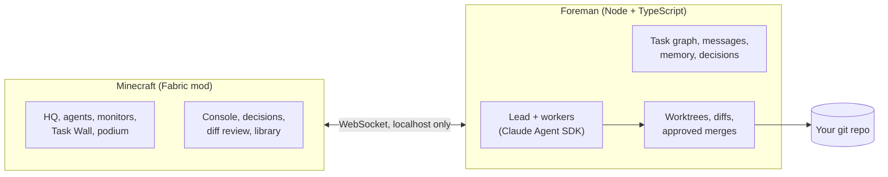

- **The Foreman** (`foreman/`) runs the agents and owns all the state: tasks and their
  dependencies, messages, shared memory, decisions and worktrees. Everything is saved to disk and
  Claude sessions resume by id, so it survives restarts and crashes.
- **The mod** (`mod/`) is the window and the controls. It draws what the Foreman knows and sends
  back what you decide. If the game closes, no work is lost.
- **The sim backend** is a scripted team that exercises every feature with real git edits. It powers
  the demo, the screenshot QA and development, without any API usage.

<details>
<summary><b>More on the Foreman</b></summary>

<br>

- **Team:** a lead (Opus by default) that plans and reviews, and up to three workers at once (Sonnet
  by default). Pick the team with `--workers`.
- **Task graph:** tasks only start when the tasks they depend on are done, and move through todo,
  doing, review and done, with blocked on the side.
- **CI loop:** your tests run after each task. A failure goes back to the worker once, then to review
  with the failure noted.
- **Merge conflicts:** when parallel work collides, the branch goes back to its worker, who merges
  your branch in, resolves it and sends a fresh review.
- **Messages:** agents message each other and you, and a message to a busy agent reaches it mid task.
- **Spend:** a running total in `/status` and the console header.
- **Protocol:** documented in [docs/protocol.md](docs/protocol.md), generated from the schemas and
  kept in sync by `npm run check`.

</details>

<br>

## Costs

The claude backend bills per token to your Anthropic or cloud provider account. A small goal costs a
few dollars. For a cheaper team:

```powershell
tools\launch.ps1 -Repo C:\path\to\repo -ForemanArgs '--model','sonnet','--effort','low','--workers','juniper,kit'
```

Measured with those settings on the sample repo: three two task goals, including two merge conflicts
the workers resolved, took 2 to 10 minutes each and about $6 in total. The sim backend is free.

<br>

## Project layout

| Path | What lives there |
|---|---|
| [`foreman/`](foreman) | The orchestrator: agents, task graph, memory, decisions, git safety, 482 tests |
| [`mod/`](mod) | The Fabric mod: HQ builder, agents, displays, screens, HUD |
| [`assets-src/`](assets-src) | Scripts that generate every skin, block texture and UI sprite |
| [`tools/`](tools) | Launcher, stop script, DevBridge CLI, screenshot and QA runner |
| [`docs/`](docs) | Protocol reference, QA guide, design notes |

<br>

## Development

```powershell
cd foreman; npm test                       # 482 tests
cd mod; .\gradlew.bat build                # the mod
node tools/qa.mjs --home .agentcraft-home  # capture the 10 shot QA gallery
```

Every visual in this README was captured in game through the **DevBridge**, a small localhost API in
the mod that scripts use to move the camera and take screenshots. Start with
[mod/DEV.md](mod/DEV.md) and [mod/FEATURES.md](mod/FEATURES.md) for the mod,
[foreman/README.md](foreman/README.md) for the orchestrator and [docs/QA.md](docs/QA.md) for the
screenshot suite.

<br>

## Status

AgentCraft is young and has been used by one person on one machine. Today it is:

- **Windows, macOS and Linux development launchers.** All three have desktop notifications when
  the agents need a decision (Linux via `notify-send`). macOS has been tested on Apple Silicon;
  Intel Macs are not yet tested. Linux support is new and lightly tested.
- **Singleplayer,** one studio per world, on **Minecraft 26.3**.
- **Run through the development client** (`gradlew runClient`). A regular mod release for normal
  launchers is planned.

Issues and ideas are welcome.

<br>

## License

[MIT](LICENSE). All art (skins, block textures and UI sprites) is generated by the scripts in
`assets-src/` and is covered by the same license. Minecraft is not included: Gradle downloads it from
Mojang for development, and players need their own copy of Minecraft: Java Edition. AgentCraft is
not affiliated with Mojang, Microsoft or Anthropic.

<div align="center">
<br>
<sub>Built with Claude.</sub>
</div>
