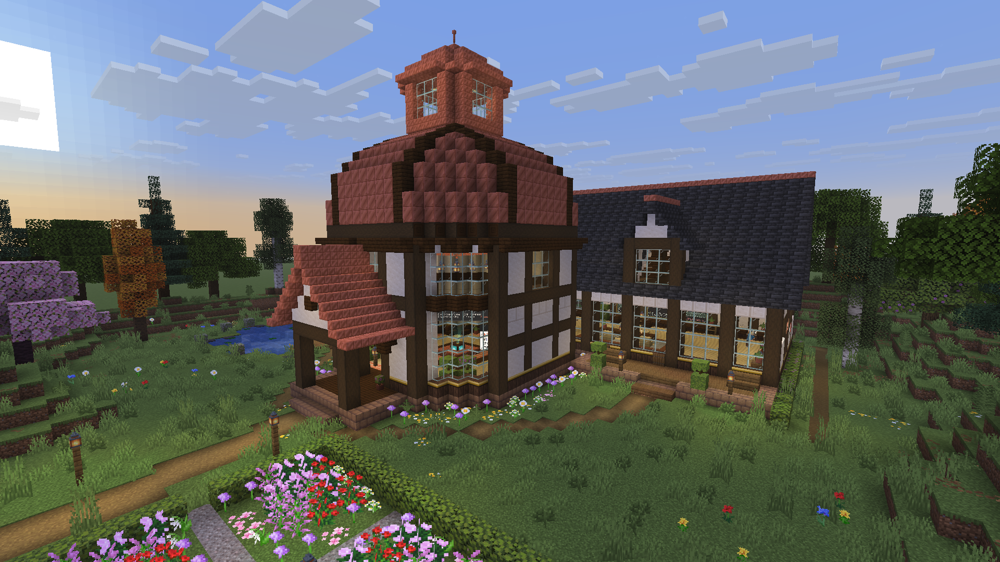
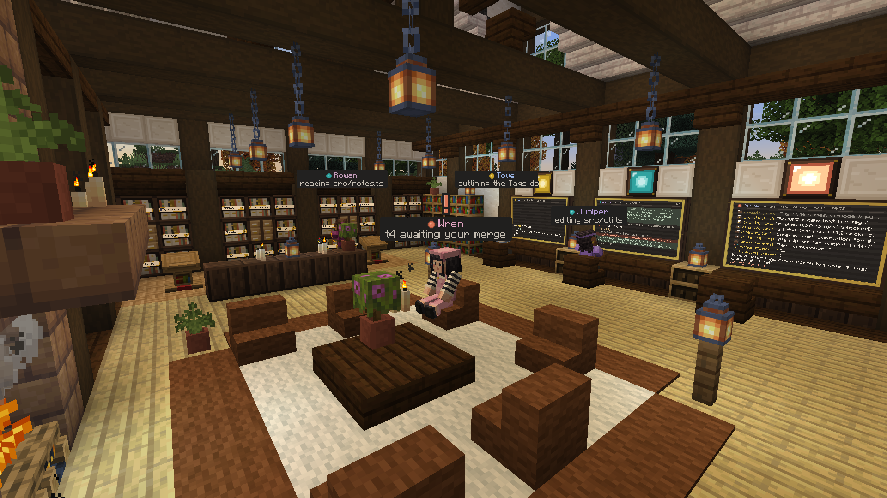
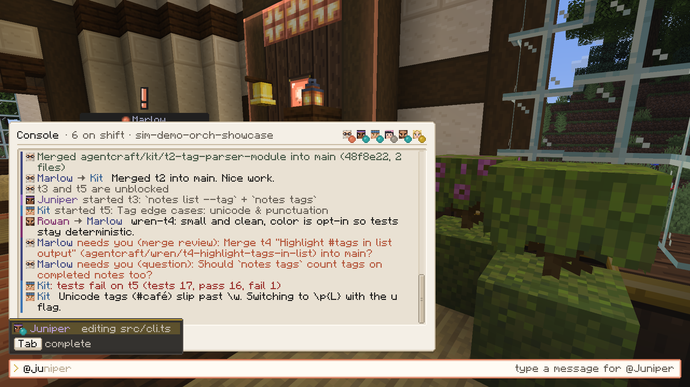
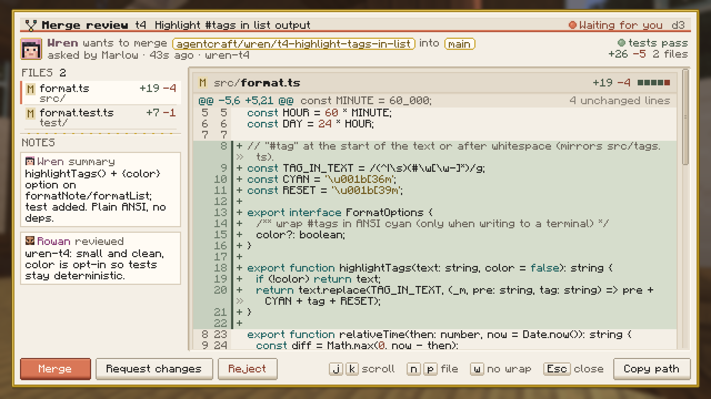

# AgentCraft

*Powered by Claude.* Minecraft as a spatial UI for real multi-agent Claude work. A team of Claude agents (a lead plus
workers) splits up a goal, works in real git worktrees of your repo, talks to each other, and shows
its progress physically in a Minecraft studio: desks with live monitors, a Task Wall, a Decision
Podium, a merge station with diff review, and a memory library. You steer everything from an
in-game console and answer the agents' questions when they come to you.




| Console | Merge review |
|---|---|
|  |  |

## How it works

- **Foreman** (`foreman/`, Node + TypeScript, Claude Agent SDK) runs the agents and is the source
  of truth: task graph, messages, shared memory, decisions, git worktrees. It keeps working when
  the game is closed, and all state survives restarts (`~/.agentcraft`).
- **Mod** (`mod/`, Fabric for Minecraft 26.3) is the view and input device. It connects to the
  Foreman over a local WebSocket (127.0.0.1 only).
- Backends: `claude` (real agents through the Claude Agent SDK) or `sim` (a scripted demo team, no
  API usage).

## Requirements

Windows 10/11, Java 25 on PATH (Temurin), Node 22+ and git. The first launch downloads Gradle,
Minecraft and Fabric through the Gradle wrapper (a few minutes). You don't need a Minecraft launcher.

For the real agents you need **Claude API access**, either of these:
- `ANTHROPIC_API_KEY`: create a key at [console.anthropic.com](https://console.anthropic.com) and set
  it, e.g. `setx ANTHROPIC_API_KEY sk-ant-...` (then open a new terminal), or
- a cloud provider supported by the Agent SDK: Amazon Bedrock (`CLAUDE_CODE_USE_BEDROCK=1`), Google
  Vertex AI (`CLAUDE_CODE_USE_VERTEX=1`) or Microsoft Foundry (`CLAUDE_CODE_USE_FOUNDRY=1`), with
  that provider's usual credentials.

Without either, the claude backend shows an "auth failed" banner and the sim backend still works.

**Personal use only:** if you already use Claude Code, `tools\launch.ps1 -UseClaudeLogin` runs the
agents on your own `claude` CLI login instead of an API key. Anthropic doesn't allow third-party
tools to offer claude.ai login to their users, so this is off by default and meant for running
AgentCraft yourself, not for offering it to others. To make it permanent for yourself, put
`{"claude": {"useClaudeLogin": true}}` in `~/.agentcraft/config.json`.

## Launch

```powershell
tools\launch.ps1 -Backend sim                       # demo team, no API usage
tools\launch.ps1 -Repo C:\path\to\your\repo        # real agents on your repo (claude backend)
tools\stop.ps1                                      # stop everything launch.ps1 started
```

`launch.ps1` starts the Foreman (or reuses a running one), installs npm dependencies on first
run, builds the mod, and opens the game straight into the "AgentCraft HQ" world. Close the game
any time: the agents keep working, and the game resyncs when you reopen it. Useful flags:
`-Reset` (fresh state), `-Speed N` (sim speed), `-Port/-DevPort` (if 7878/7879 are taken), and
`-Showcase busy|late` (static demo state). The studio builds itself on the first launch. In an
older world, rebuild it with `/agentcraft hq`.

**Your name.** The agents address you by your OS user name. To use another name, pass
`-ForemanArgs '--user-name','Sam'`, set `AGENTCRAFT_USER_NAME`, or put `{"userName": "Sam"}` in
`~/.agentcraft/config.json`. Your in-game player name in the dev run comes from `AGENTCRAFT_PLAYER`
(defaulting to the OS user name).

## Daily workflow

| Key | Does |
|---|---|
| `` ` `` (backtick) | Open the **console** (all keys are rebindable in Options → Controls) |
| `Enter` while looking at a console terminal | Console |
| `J` | **Answer decisions**: the oldest open question, permission or merge |
| Right-click an agent | Agent card: state, task, last log lines, message/pause/stop |
| Right-click podium / merge station / archive / lectern / task card | Decisions / diff review / memory library / task details |

Console input:

- plain text: **new goal** for the team
- `@juniper text`: message an agent (Tab completes names)
- `/answer [d4] <n|option> [text]` · `/diff [worktree|@agent]` · `/status` · `/repos` · `/repo add <path>`
- `/pause @x` · `/resume @x` · `/stop @x` (off shift; its task goes back on the board) · `/spawn @x [task]`
- `/help` for everything, Up/Down for history

When an agent needs you, a clay "!" appears over its head, it walks to the podium, the HUD shows
"N waiting · press J", and Windows shows a toast. Merge decisions open a full diff review
(file list, line numbers, j/k scroll, n/p switch files) with **Merge / Request changes / Reject**.

## Safety model

- Every worker gets its own git worktree on branch `agentcraft/<agent>/<task>`. Your checked-out
  branch is only touched by a merge **you** approve. A merge is refused if your checkout is dirty. If it
  would conflict (parallel tasks touched the same lines), the branch goes back to its worker, who
  merges your branch into it and resolves the conflict; you then get a fresh merge review.
- **Nothing ever pushes.** Agents have no git network access at all (blocked at the git level, not
  only by the permission policy), and the Foreman's own git calls run no repository hooks.
- Reads and edits inside the worktree are auto-allowed. Anything else risky (writing outside the
  worktree, network, destructive shell commands) becomes a **permission** decision in-game:
  Allow once / Always allow (the exact scope is shown) / Deny.
- Agents' commits are authored "AgentCraft <Name>". Only the merge you approve is made as you.

## Costs

The claude backend defaults to lead = Opus and workers = Sonnet at medium effort, with at most 3
workers at once and a lead review per task. API usage is billed per token to your Anthropic (or
cloud provider) account. A small goal costs a few dollars. Cheaper:
`-ForemanArgs '--model','sonnet','--effort','low'`. Measured with that (and `'--workers','juniper,kit'`)
on the demo repo: three two-task goals, including two merge conflicts the workers resolved, took
2-10 minutes each and about $6 in total. The console header and `/status` show the running total.
Pass `-ForemanArgs` from a PowerShell prompt (an array). Through `powershell -File` it arrives as one
comma-joined string, which the Foreman now refuses as an unknown option rather than ignoring it.
The `sim` backend costs nothing.

## Troubleshooting

- **"Foreman not running" pill**: start it with `tools\launch.ps1`, or check
  `artifacts\logs\foreman-<profile>.log`.
- **Auth banner (claude)**: set `ANTHROPIC_API_KEY` (or a cloud provider, see Requirements) and
  relaunch. With `-UseClaudeLogin`: run `claude`, then `/login`, then relaunch.
- **Port in use**: pass `-Port` / `-DevPort`.
- **Terminal view of the team**: `cd foreman; npm run tui -- --port 7878`.

## For developers

`mod/DEV.md` (build, DevBridge camera/screenshot API, 26.3 notes), `mod/FEATURES.md` (feature
packages and the state-model API), `foreman/README.md`, `docs/protocol.md`, `docs/QA.md`
(`node tools/qa.mjs` captures the QA camera set), `assets-src/README.md` (art pipeline).
Tests: `cd foreman; npm test` (481 tests).

## License

MIT. See [LICENSE](LICENSE). All art (skins, block textures, UI sprites) is generated by the scripts in `assets-src/` and is covered by the same license. Minecraft itself is not included: the Gradle build downloads it from Mojang for development, and players need their own copy of Minecraft: Java Edition.
